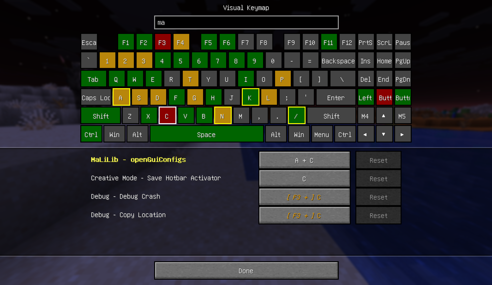

# Visual Keymap

English | [简体中文](docs/README.zh-CN.md)



This mod allows you to visually view the currently bound key positions in the game through keyboard layout, and change the key position bindings from various mods in a unified configuration page.

You can open the key map interface through the `Controls - Visual Keymap` menu, or enter the configuration screen of this mod in ModMenu. This mod currently provides integration between MaLiLib and CommandKeys.

## Support platform

Fabric 1.21.10 and above versions

## Integration

All mods with independent key binding systems can use this feature by setting entrypoints.

```json
"entrypoints": {
  "visualkeymap": [
    "com.example.mymod.MyModVisualKeymapImpl"
  ]
}
```

The entry point class needs to implement the `dev.xef2.visualkeymap.api.VisualKeymapApi` interface. The specific implementation method can refer to the `dev.xef2.visualkeymap.api.MinecraftImpl` class.
