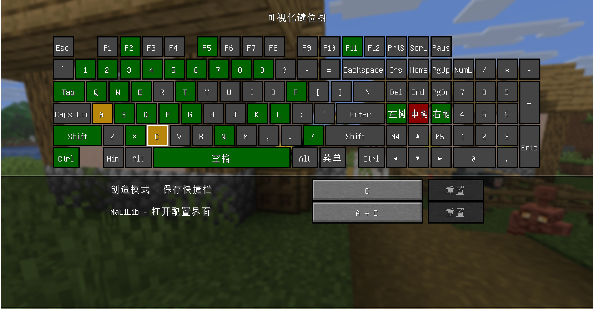

# 可视化键位图

[English](../README.md) | 简体中文



本 Mod 允许你在游戏中以键盘布局可视化查看当前绑定的键位，并且在统一的配置页面中更改来自各个 Mod 的键位绑定。

可以通过 `按键控制 - 可视化键位图` 菜单打开键位图界面，或是在 ModMenu 中进入本 Mod 配置屏幕。本 Mod 目前提供了 MaLiLib 与 CommandKeys 的集成。

## 支持平台

Fabric 1.21.10 及以上版本

## 集成

所有拥有独立键位绑定系统的 Mod 都可以通过设置入口点使用此功能。

```json
"entrypoints": {
  "visualkeymap": [
    "com.example.mymod.MyModVisualKeymapImpl"
  ]
}
```

入口点类需要实现 `dev.xef2.visualkeymap.api.VisualKeymapApi` 接口，具体实现方式可参考 `dev.xef2.visualkeymap.api.MinecraftImpl` 类。
